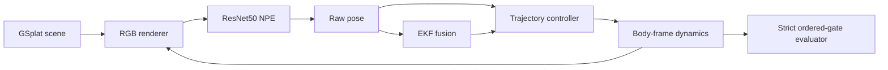

# Architecture

QuadPilot separates the runtime by responsibility so that control tests do not
need PyTorch and data-download tools do not import the renderer.

## Source packages

| Package | Responsibility |
|:--|:--|
| `quadpilot.control` | trajectory generation, planner/controller, dynamics |
| `quadpilot.datasets` | deterministic sampling, resumable rendering receipts |
| `quadpilot.estimation` | pose EKF |
| `quadpilot.perception` | NPE model/checkpoints, GSplat pose transform and renderer |
| `quadpilot.simulation` | track contracts, closed-loop runners, strict evaluation |
| `quadpilot.hardware` | offline calibration and readiness gates |
| `quadpilot.verification` | locked result comparisons |
| `quadpilot.cli` | the single `quadpilot` command surface |

The package uses a `src/` layout. Install it with `python -m pip install -e .`
rather than adding repository directories to `sys.path` inside production code.

## Runtime boundary

Truth state is used only to render the next image and advance the simulated
plant. The controller receives a pose from the NPE directly or an EKF state.
Strict evaluation uses the configured incoming side of every gate and requires
the complete per-track order for two laps.

The physical interface is intentionally outside the simulation loop until the
calibration and prop-off readiness contract passes. See
[hardware safety](hardware_safety.md).
